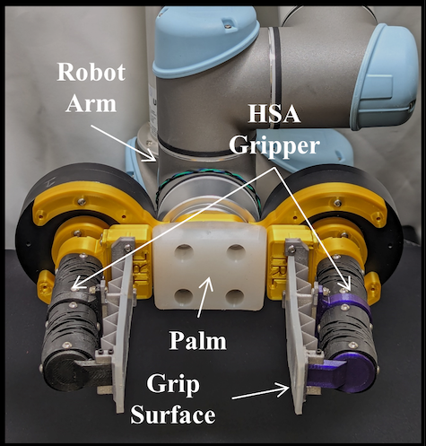

::: {.text-center style="margin-top: 60px;"}

{width=180px .profile-photo}

[**Srivatsan Balaji**]{.hero-name}

[Research Engineer / Faculty Research Assistant\
Collaborative Robotics and Intelligent Systems (CoRIS) Institute, Oregon State University]{.affiliation}

[Interests: Soft and Materials Robotics]{.italic-text}

<a href="cv/CV_SrivatsanBalaji.pdf" target="_blank" style="text-decoration: none;"><i class="fa-solid fa-file" style="font-size: 1.0em;"></i>&nbsp; [View CV]{.affiliation}</a>

:::

::: {style="max-width: 1100px; margin: 50px auto; text-align: justify;"}

I was a Research Engineer in the Intelligent Machines and Materials Lab, part of Collaborative Robotics and Intelligent Systems (CoRIS) Institute at Oregon State University. I developed hardware for integrating flexible electronics to underwater robots. My work sits at the intersection of mechanical design, robotics, and materials.

Outside of work, I am a virtual pilot and hobbyist photographer.

## How I Work

```{=html}
<div class="flow-track">

  <div class="flow-node flow-node--split flow-node--img">
    
    <div class="flow-node__overlay">
      <div class="flow-node__idx"></div>
      <div class="flow-node__label">Design</div>
      <div class="flow-node__sub">SolidWorks, Fusion 360, Inventor &mdash; soft robotic systems &amp; end effectors</div>
    </div>
  </div>

  <svg class="flow-conn" data-dir="out" aria-hidden="true"></svg>

  <div class="flow-branch">
    <div class="flow-node flow-node--img">
      
      <div class="flow-node__overlay">
        <div class="flow-node__idx"></div>
        <div class="flow-node__label">Fabrication</div>
        <div class="flow-node__sub">FDM, SLA, material jetting, silicone casting</div>
      </div>
    </div>
    <div class="flow-node flow-node--img">
      
      <div class="flow-node__overlay">
        <div class="flow-node__idx"></div>
        <div class="flow-node__label">Materials</div>
        <div class="flow-node__sub">Auxetic metamaterials, mechanical characterization</div>
      </div>
    </div>
    <div class="flow-node flow-node--img">
      
      <div class="flow-node__overlay">
        <div class="flow-node__idx"></div>
        <div class="flow-node__label">Computation</div>
        <div class="flow-node__sub">Python, MATLAB &mdash; feedback and control</div>
      </div>
    </div>
  </div>

  <svg class="flow-conn" data-dir="in" aria-hidden="true"></svg>

  <div class="flow-node flow-node--merge flow-node--img">
    
    <div class="flow-node__overlay">
      <div class="flow-node__idx"></div>
      <div class="flow-node__label">Advanced Hardware</div>
      <div class="flow-node__sub">Integrated hardware for underwater robotic systems</div>
    </div>
  </div>

</div>

```

## Focus Areas

```{=html}
<div class="focus-grid">
  <a class="focus-card" href="research.qmd#high-payload-soft-robots">
    
    <span class="focus-card__label">High-Payload Soft Robots</span>
  </a>
  <a class="focus-card" href="research.qmd#underwater-robotics">
    
    <span class="focus-card__label">Underwater Robotics</span>
  </a>
  <a class="focus-card" href="research.qmd#agricultural-robotics">
    
    <span class="focus-card__label">Agricultural Robotics</span>
  </a>
  <a class="focus-card" href="research.qmd#medical-robotics">
    
    <span class="focus-card__label">Medical Robotics</span>
  </a>
</div>
```

<style>
/* ── Signature: How I Work — diverge (Design) / converge (Advanced Hardware) ── */
.flow-track {
  display: grid;
  grid-template-columns: 1.2fr 0.6fr 1.3fr 0.6fr 1.3fr;
  align-items: center;
  min-height: 300px;
  margin: 18px 0 8px;
}
.flow-node {
  position: relative;
  padding: 1.2rem 1.1rem;
  border: 1px solid var(--border, #444);
  border-radius: 10px;
  background: rgba(255, 255, 255, 0.02);
  overflow: hidden;
}
.flow-node--img { padding: 0; min-height: 150px; }
.flow-node__bg { position: absolute; inset: 0; width: 100%; height: 100%; object-fit: cover; z-index: 0; }
.flow-node__overlay {
  position: relative; z-index: 1; height: 100%;
  padding: 1.2rem 1.1rem;
  background: linear-gradient(200deg, rgba(10, 10, 12, 0.4), rgba(10, 10, 12, 0.82));
}
.flow-node__idx { font-family: ui-monospace, SFMono-Regular, Menlo, monospace; font-size: 0.7rem; color: #FDD26E; }
.flow-node__label { font-size: 1.05rem; font-weight: 600; margin: 0.4rem 0 0.3rem; color: #fff; }
.flow-node__sub { font-size: 0.85rem; color: #d8d8d8; text-align: left; }

.flow-branch { display: flex; flex-direction: column; gap: 1.2rem; }

.flow-conn { width: 100%; height: 100%; min-height: 260px; display: block; }
.flow-conn path { fill: none; stroke-width: 1.4; vector-effect: non-scaling-stroke; }
.flow-conn .flow-lead { stroke: #FDD26E; opacity: 0.55; }

.flow-thesis {
  margin-top: 1.6rem; max-width: 780px;
  font-style: italic; font-size: 1.05rem; color: #d8d8d8;
  padding-left: 1rem; border-left: 2px solid #FDD26E;
  text-align: left;
}

/* fade in once the script has measured real node positions and drawn the paths */
.flow-conn { opacity: 0; transition: opacity 0.6s ease 0.1s; }
.flow-conn.is-ready { opacity: 1; }

/* ── Focus Areas: clickable image cards into the Research page ── */
.focus-grid { display: grid; grid-template-columns: repeat(4, 1fr); gap: 14px; margin: 18px 0 8px; }
.focus-card {
  position: relative; display: block; aspect-ratio: 4 / 3;
  border: 1px solid var(--border, #444); border-radius: 10px; overflow: hidden;
  text-decoration: none; transition: transform 0.3s ease, border-color 0.3s ease;
}
.focus-card:hover { transform: translateY(-3px); border-color: #FDD26E; }
.focus-card img { width: 100%; height: 100%; object-fit: cover; display: block; }
.focus-card__label {
  position: absolute; left: 0; right: 0; bottom: 0; padding: 12px 10px 8px;
  background: linear-gradient(transparent, rgba(0, 0, 0, 0.78));
  color: #fff; font-size: 0.92rem; font-weight: 600;
}

/* ── Responsive: stack the flow vertically, collapse the focus grid ── */
@media (max-width: 760px) {
  .flow-track { grid-template-columns: 1fr; gap: 1rem; min-height: 0; }
  .flow-conn { display: none; }
  .flow-node--split::after, .flow-branch::after {
    content: "\2193"; display: block; text-align: center; color: #FDD26E; opacity: 0.6; margin-top: 1rem;
  }
  .flow-branch { gap: 1rem; }
  .flow-node__sub, .flow-thesis { text-align: left; }
  .focus-grid { grid-template-columns: repeat(2, 1fr); }
}

@media (prefers-reduced-motion: reduce) {
  .flow-conn { transition: none; }
}
</style>

<script>
(function () {
  // Draws each .flow-conn by measuring the actual on-screen position of the
  // single node on one side and every .flow-node inside .flow-branch on the
  // other. Add or remove a node in the branch and this just adapts — no
  // coordinates to hand-edit.
  var SVGNS = "http://www.w3.org/2000/svg";

  function draw() {
    document.querySelectorAll(".flow-conn").forEach(function (svg) {
      var dir = svg.dataset.dir; // "out" = fans from single node into branch; "in" = branch merges into single node
      var branch = dir === "out" ? svg.nextElementSibling : svg.previousElementSibling;
      var single = dir === "out" ? svg.previousElementSibling : svg.nextElementSibling;
      if (!branch || !single) return;

      var nodes = branch.querySelectorAll(":scope > .flow-node");
      var svgRect = svg.getBoundingClientRect();
      var w = svgRect.width, h = svgRect.height;
      if (!w || !h) return; // hidden (e.g. mobile layout) — skip until it's visible again

      svg.setAttribute("viewBox", "0 0 " + w + " " + h);
      svg.innerHTML = "";

      var singleRect = single.getBoundingClientRect();
      var singleY = singleRect.top + singleRect.height / 2 - svgRect.top;
      var midX = w / 2;

      nodes.forEach(function (node) {
        var r = node.getBoundingClientRect();
        var ny = r.top + r.height / 2 - svgRect.top;
        var d = dir === "out"
          ? "M0," + singleY + " C" + midX + "," + singleY + " " + midX + "," + ny + " " + w + "," + ny
          : "M0," + ny + " C" + midX + "," + ny + " " + midX + "," + singleY + " " + w + "," + singleY;
        var path = document.createElementNS(SVGNS, "path");
        path.setAttribute("class", "flow-lead");
        path.setAttribute("d", d);
        svg.appendChild(path);
      });

      svg.classList.add("is-ready");
    });
  }

  window.addEventListener("load", draw);

  var rt;
  window.addEventListener("resize", function () {
    clearTimeout(rt);
    rt = setTimeout(draw, 150);
  });
})();
</script>

:::
