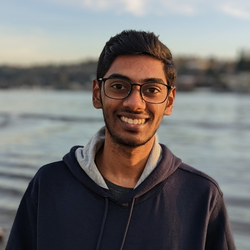

{width=150px style="border-radius: 50%;"}

Srivatsan Balaji

Research Engineer / Faculty Research Assistant  
Collaborative Robotics and Intelligent Systems (CoRIS) Institute, Oregon State University

*Interests: Materials and Soft Robotics*

I am a Research Engineer in the Intelligent Machines and Materials Lab, part of Collaborative Robotics and Intelligent Systems (CoRIS) Institute at Oregon State University. I am currently developing hardware for underwater robots. 

I have a graduate degree in Mechanical Engineering from the University of Washington, Seattle. Prior to that, I completed my undergrad at SRM Institute of Science and Technology in Chennai, India.

My work sits at the intersection of materials, mechanical design and robotics. Outside of work, I am a virtual pilot and a hobbyist photographer.

## Skills

**Design & Fabrication** 
CAD Modeling, Rapid prototyping, 3D printing: Fused Deposition Modeling (FDM), Stereolithography (SLA), Material Jetting, CNC 
*Software: SolidWorks, Autodesk Fusion 360, Autodesk Inventor (to some extent)* 
*Machines: Prusa FDM Printers, Carbon M1 SLA Printer, Stratasys J750, Bantam Desktop CNC*

**Testing & Analysis** 
Finite Element Analysis (FEA), Material Characterization 
*Software: Ansys Mechanical, MATLAB, Ansys Fluent (CFD) - fundamental fluid flow analysis* 
*Testing: Instron Universal Testing System*

**Programming** 
Python

**Research** 
Experiment Design, Scientific and Technical Writing, Presentation

