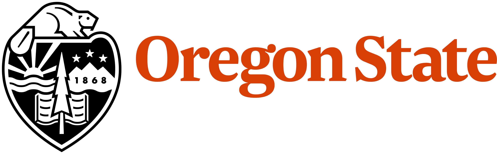

{width=150px style="border-radius: 50%;"}

Srivatsan Balaji

Research Engineer / Faculty Research Assistant  
Collaborative Robotics and Intelligent Systems (CoRIS) Institute, Oregon State University

*Interests: Materials and Soft Robotics*

<a href="cv/CV_SrivatsanBalaji.pdf" target="_blank" style="text-decoration: none;">
<i class="fa-solid fa-file-lines" style="color: #85754d;"></i> &nbsp; View CV
</a>

I am a Research Engineer in the Intelligent Machines and Materials Lab, part of Collaborative Robotics and Intelligent Systems (CoRIS) Institute at Oregon State University. I am currently developing hardware for underwater robots. 
My work sits at the intersection of materials, mechanical design and robotics.

I have a Master of Science ([MS]{.slanted}) degree in Mechanical Engineering from the University of Washington, Seattle. Prior to that, I completed my Bachelor of Technology ([B. Tech.]{.slanted}) in Chemical Engineering at SRM Institute of Science and Technology, Chennai, India.

Outside of work, I am a virtual pilot and a hobbyist photographer.

## Skills

**Design & Fabrication** 
CAD Modeling; Rapid prototyping; 3D printing: Fused Deposition Modeling (FDM), Stereolithography (SLA), Material Jetting; Silicone Casting; CNC 
[Software: SolidWorks, Autodesk Fusion 360, Autodesk Inventor (to some extent)]{.slanted} 
[Machines: Prusa FDM Printers, Carbon M1 SLA Printer, Stratasys J750, Bantam Desktop CNC]{.slanted}

**Testing & Analysis** 
Finite Element Analysis (FEA); Material Characterization 
[Software: Ansys Mechanical, MATLAB, Ansys Fluent (CFD) - fundamental fluid flow analysis]{.slanted} 
[Testing: Instron Universal Testing System]{.slanted}

**Programming** 
Python

**Research** 
Experiment Design, Scientific and Technical Writing, Presentation

