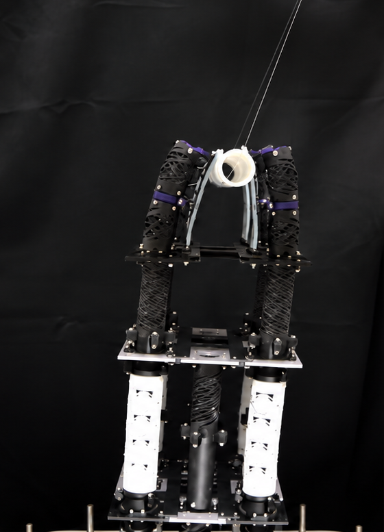
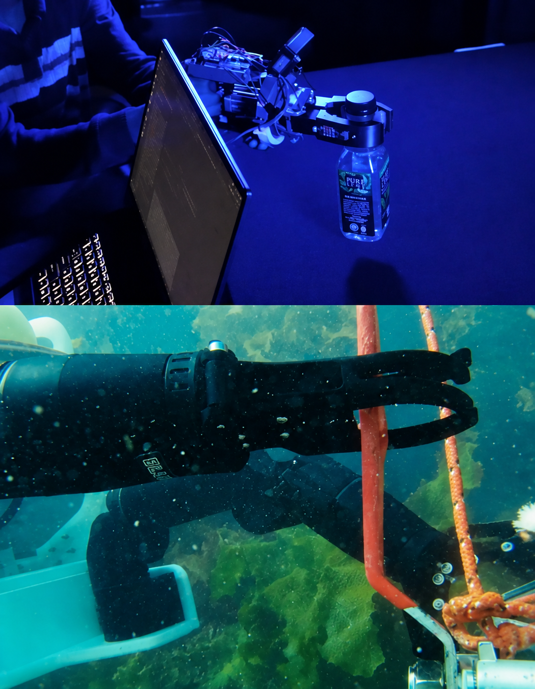
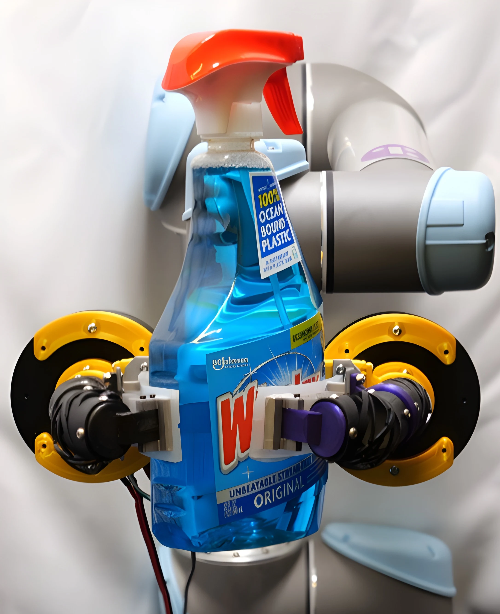

<div id="constellation-bg" aria-hidden="true"></div>

<style>
html { background: #000000; }
body,
header#quarto-header,
#quarto-header .navbar,
#quarto-content,
#quarto-document-content,
.quarto-container,
.page-columns,
main.content,
.navbar-container,
.quarto-title-block {
  background: transparent !important;
}
#constellation-bg {
  position: fixed;
  inset: 0;
  z-index: -1;
  pointer-events: none;
}
#quarto-header .navbar {
  box-shadow: 0 1px 0 rgba(255,255,255,0.06);
}
.homepage-work {
  display: flex;
  flex-wrap: wrap;
  justify-content: center;
  gap: 1.25rem;
  margin-top: 5rem;
}
.homepage-card {
  flex: 0 1 calc((100% - 2.5rem) / 3);
  min-width: 0;
  max-width: 360px;
  position: relative;
  overflow: hidden;
  border: 1px solid rgba(253, 210, 110, 0.18);
  border-radius: 0.85rem;
  background: rgba(19, 13, 24, 0.52);
  color: #fff;
  isolation: isolate;
  transition: transform 220ms ease, border-color 220ms ease, box-shadow 220ms ease;
}
.homepage-card img {
  display: block;
  width: 100%;
  aspect-ratio: 4 / 5;
  object-fit: cover;
  background: #130d18;
  opacity: 0.80;
  transition: transform 300ms ease, opacity 200ms ease, filter 200ms ease;
}
.homepage-card:hover,
.homepage-card:focus-visible {
  transform: translateY(-6px);
  border-color: rgba(253, 210, 110, 0.56);
  box-shadow: 0 16px 32px rgba(0, 0, 0, 0.30);
}
.homepage-card:hover img,
.homepage-card:focus-visible img {
  transform: scale(1.045);
  opacity: 0.94;
  filter: saturate(1.08);
}
@media (max-width: 760px) {
  .homepage-work { margin-top: 3rem; gap: 0.6rem; }
}
@media (prefers-reduced-motion: reduce) {
  .homepage-card,
  .homepage-card img { transition: none; }
  .homepage-card:hover,
  .homepage-card:focus-visible,
  .homepage-card:hover img,
  .homepage-card:focus-visible img { transform: none; }
}
</style>

<script src="assets/vendor/tsparticles/3.9.1/tsparticles.slim.bundle.min.js"></script>
<script>
(async function () {
  // HOMEPAGE ANIMATION SETTINGS — edit these values, then run quarto render.
  // Counts are fixed budgets, not multiplied by screen area or pixel density.
  const SETTINGS = {
    speed: 0.50,                          // lower = slower drift
    colors: ['#FDD26E', '#FDD26E', '#87D7F2'],
    particleCount: 100,                    // desktop; keep below 100
    mobileParticleCount: 40,              // screens up to 760 CSS pixels wide
    particleSize: { min: 1.0, max: 2.0 },
    particleOpacity: { min: 0.30, max: 0.60 },
    linkColor: '#FDD26E',
    linkDistance: 200,                    // CSS pixels; larger = more connections
    linkOpacity: 0.20,
    fps: 30                              // 20–30 is enough for a background
  };

  const host = document.getElementById('constellation-bg');
  if (!host) return;
  // Escape Quarto's content column so the background covers the viewport.
  document.body.appendChild(host);
  const motion = window.matchMedia('(prefers-reduced-motion: reduce)');
  try {
    await loadSlim(tsParticles);
    const optionsForMotion = () => ({
        autoPlay: !motion.matches,
        fpsLimit: SETTINGS.fps,
        detectRetina: false,
        fullScreen: { enable: false },
        pauseOnBlur: true,
        pauseOnOutsideViewport: false,
        interactivity: {
          events: { onHover: { enable: false }, onClick: { enable: false } }
        },
        particles: {
          number: {
            value: SETTINGS.particleCount,
            density: { enable: false }
          },
          color: { value: SETTINGS.colors },
          shape: { type: 'circle' },
          size: { value: SETTINGS.particleSize },
          opacity: { value: SETTINGS.particleOpacity },
          links: {
            enable: true, color: SETTINGS.linkColor,
            distance: SETTINGS.linkDistance, opacity: SETTINGS.linkOpacity, width: 0.7
          },
          move: { enable: !motion.matches, speed: SETTINGS.speed, outModes: { default: 'bounce' } }
        },
        responsive: [{
          maxWidth: 760,
          options: { particles: { number: { value: SETTINGS.mobileParticleCount } } }
        }]
    });
    const field = await tsParticles.load({ id: 'constellation-bg', options: optionsForMotion() });
    if (!field) return;
    if (motion.matches) field.draw(true);
    let pending = Promise.resolve();
    motion.addEventListener('change', () => {
      field.pause();
      // v3 refresh rebuilds from source options; reset replaces that source.
      pending = pending.then(async () => {
        await field.reset(optionsForMotion());
        if (motion.matches) { field.pause(); field.draw(true); }
      });
      return pending;
    });
  } catch (error) {
    // The base CSS background remains usable if canvas or the library fails.
    console.warn('Constellation unavailable; using static background.', error);
  }
})();
</script>

::: {.message style="max-width: 1100px; margin: 60px auto 0; line-height: 1.6;"}

::: {.text-center}

#### Designing adaptive robotic hardware that help robots work reliably in the messy real world.
:::

::: {style="text-align: center; margin-top: 50px;"}
I aim to enhance the capabilities of robots by building hardware that overcomes existing physical limitations. When the hardware is smart, adaptive, and structurally resilient, software boundary expands.
:::

```{=html}
<div class="homepage-work" aria-label="Research areas">
  <a class="homepage-card" href="research.html" aria-label="Explore soft robotics research">
    <picture>
      <source type="image/webp" srcset="assets/homepage/hsa-arm-pull-900.webp">
      
    </picture>
  </a>
  <a class="homepage-card" href="research.html" aria-label="Explore underwater robotics research">
    <picture>
      <source type="image/webp" srcset="assets/homepage/underwater-test-900.webp">
      
    </picture>
  </a>
  <a class="homepage-card" href="research.html" aria-label="Explore tactile sensing research">
    <picture>
      <source type="image/webp" srcset="assets/homepage/hsagripper-windex-900.webp">
      
    </picture>
  </a>
</div>
```


:::