

I am a hobbyist photographer, a virtual pilot, and an active air traffic controller on [VATSIM](https://www.vatsim.net){target="_blank"}.

<figure style="margin: 0;">

<figcaption style="text-align:center; color:gray; font-size:0.9rem;">Sunset panoramic view of downtown Seattle with Mt. Rainier in the background</figcaption>
</figure>

<figure style="margin: 0;">

<figcaption style="text-align:center; color:gray; font-size:0.9rem;">Coal Creek, Washington</figcaption>
</figure>

<figure style="margin: 0;">
<a href="photos/PXL_20211226_185354224.jpg" target="_blank">
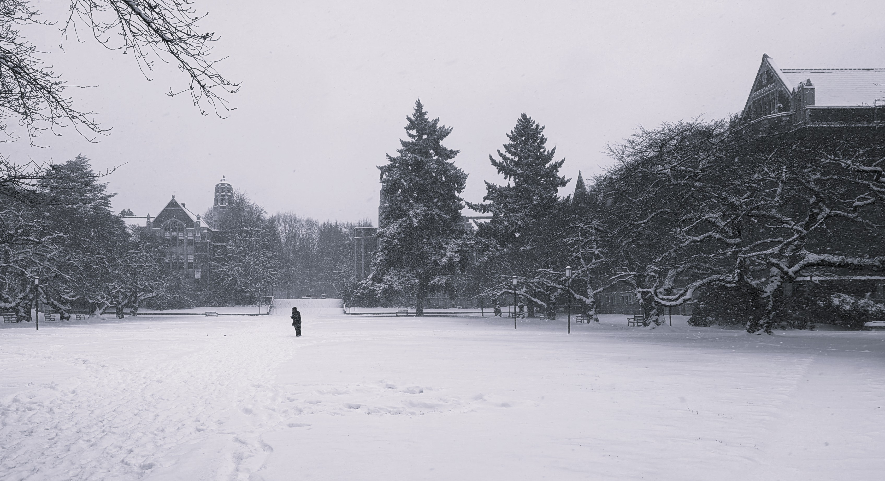
</a>
<figcaption style="text-align:center; color:gray; font-size:0.9rem;">The Quad at the University of Washington</figcaption>
</figure>

<figure style="margin: 0;">
<a href="photos/PXL_20220731_064619756.NIGHT~2.jpg" target="_blank">
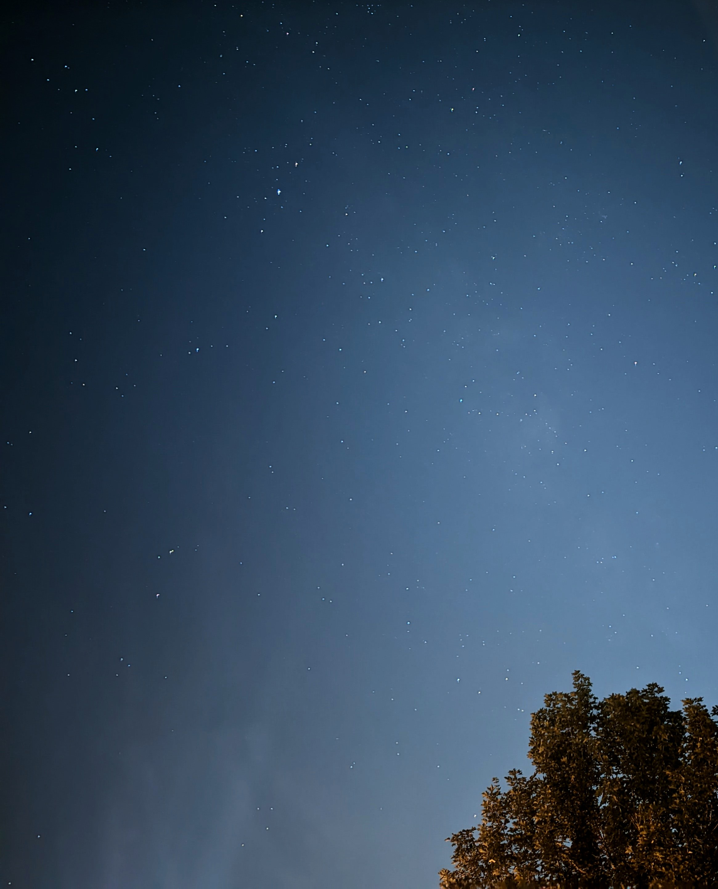
</a>
<figcaption style="text-align:center; color:gray; font-size:0.9rem;"></figcaption>
</figure>

<figure style="margin: 0;">
<a href="photos/PXL_20221023_004339139.jpg" target="_blank">
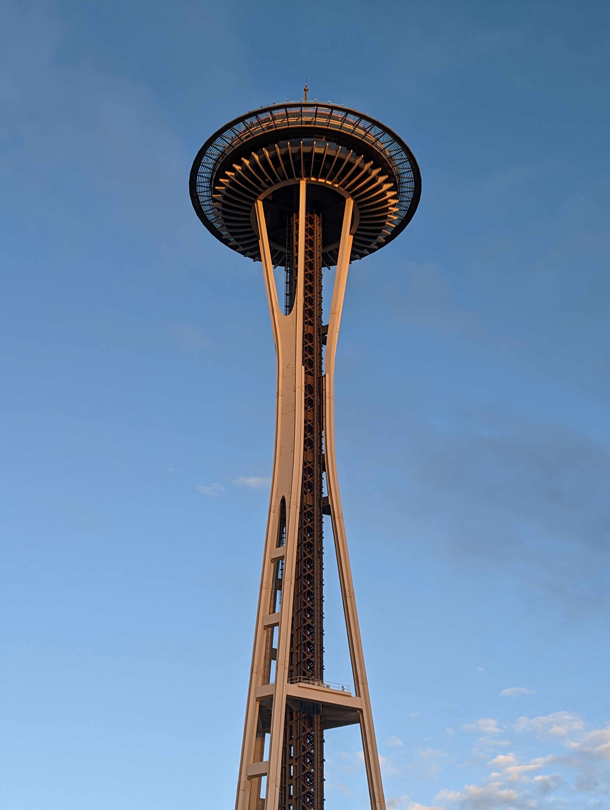
</a>
<figcaption style="text-align:center; color:gray; font-size:0.9rem;"></figcaption>
</figure>

<figure style="margin: 0;">
<a href="photos/PXL_20240101_221804405.jpg" target="_blank">
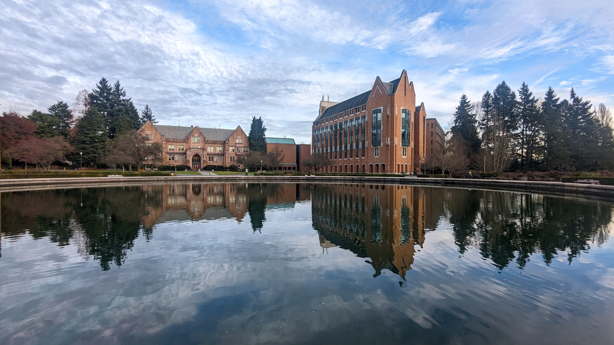
</a>
<figcaption style="text-align:center; color:gray; font-size:0.9rem;">Drumheller Foundation at the UW</figcaption>
</figure>

<figure style="margin: 0;">
<a href="photos/PXL_20240418_010033230~2.jpg" target="_blank">
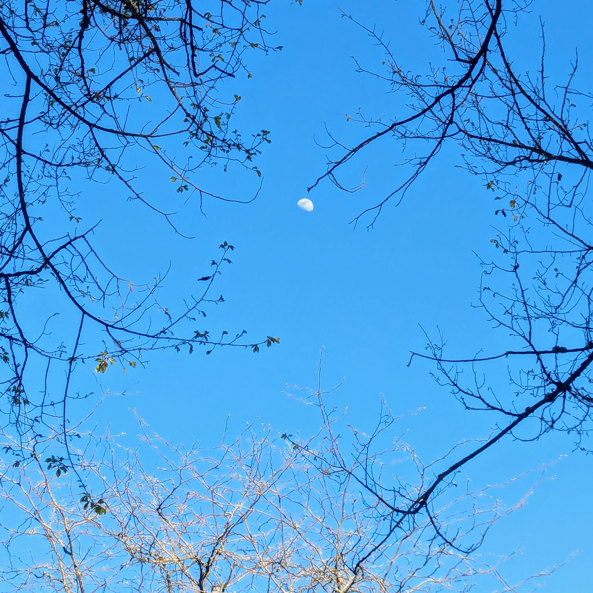
</a>
<figcaption style="text-align:center; color:gray; font-size:0.9rem;"></figcaption>
</figure>

<figure style="margin: 0;">
<a href="photos/PXL_20240922_014702847.LONG_EXPOSURE-01.COVER.jpg" target="_blank">
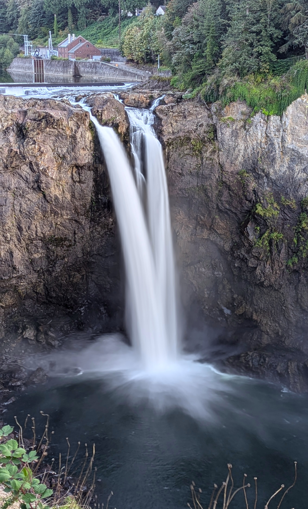
</a>
<figcaption style="text-align:center; color:gray; font-size:0.9rem;"></figcaption>
</figure>

<figure style="margin: 0;">
<a href="photos/PXL_20250514_231324573.jpg" target="_blank">
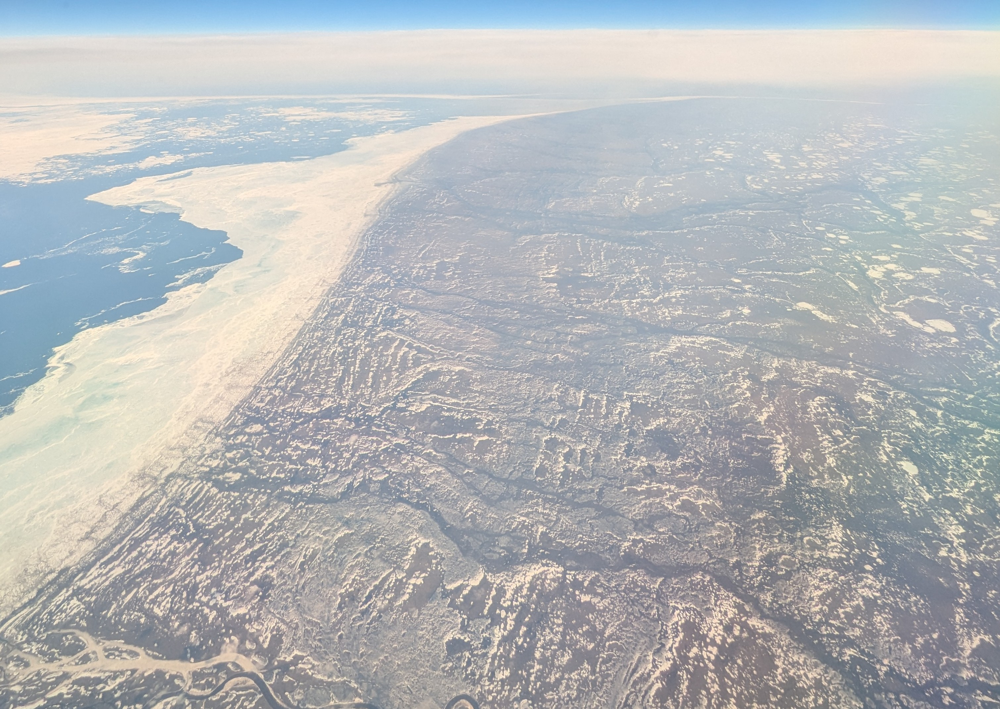
</a>
<figcaption style="text-align:center; color:gray; font-size:0.9rem;"></figcaption>
</figure>

<figure style="margin: 0;">
<a href="photos/PXL_20250514_231425261~2.jpg" target="_blank">
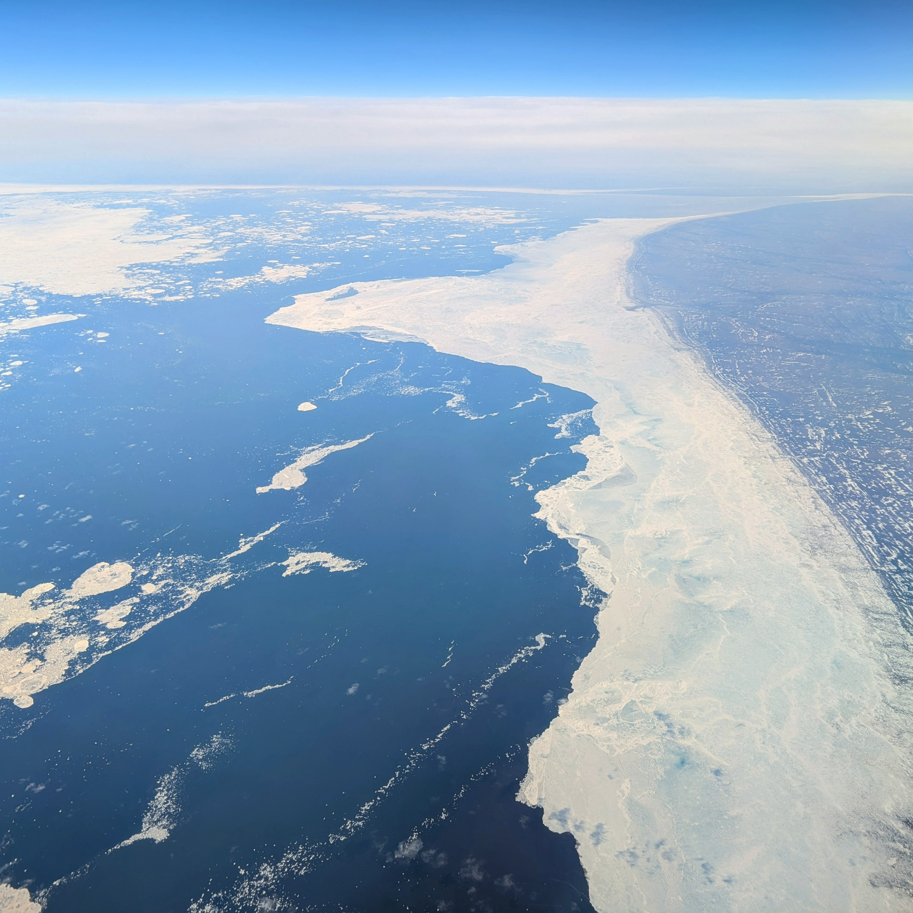
</a>
<figcaption style="text-align:center; color:gray; font-size:0.9rem;"></figcaption>
</figure>

<figure style="margin: 0;">
<a href="photos/srivatsan-balaji-8L18q92WX8g-unsplash.jpg" target="_blank">
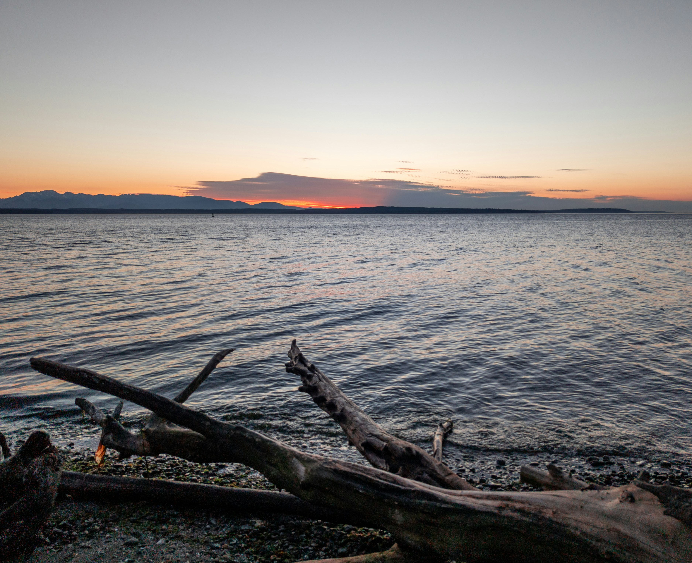
</a>
<figcaption style="text-align:center; color:gray; font-size:0.9rem;"></figcaption>
</figure>

<figure style="margin: 0;">

<figcaption style="text-align:center; color:gray; font-size:0.9rem;"></figcaption>
</figure>

<figure style="margin: 0;">
<a href="photos/srivatsan-balaji-NN6gNzLlfEM-unsplash.jpg" target="_blank">
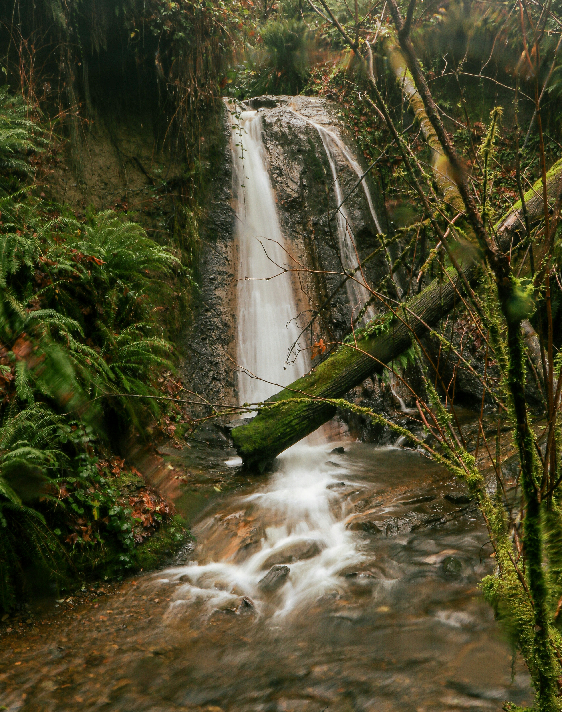
</a>
<figcaption style="text-align:center; color:gray; font-size:0.9rem;"></figcaption>
</figure>

<figure style="margin: 0;">
<a href="photos/srivatsan-balaji-T632eMad9E8-unsplash.jpg" target="_blank">
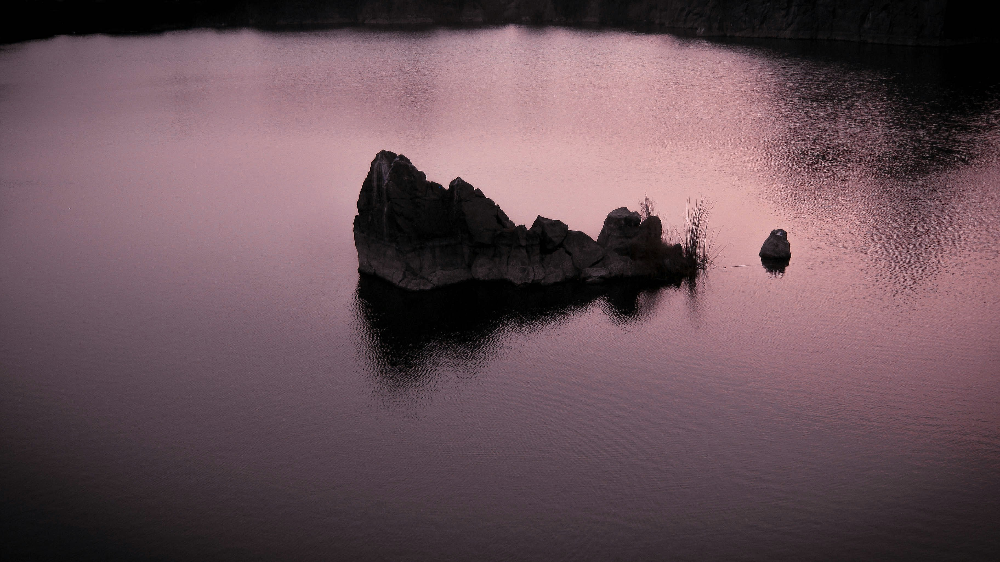
</a>
<figcaption style="text-align:center; color:gray; font-size:0.9rem;"></figcaption>
</figure>

<figure style="margin: 0;">
<a href="photos/srivatsan-balaji-vvpqI98fT60-unsplash.jpg" target="_blank">
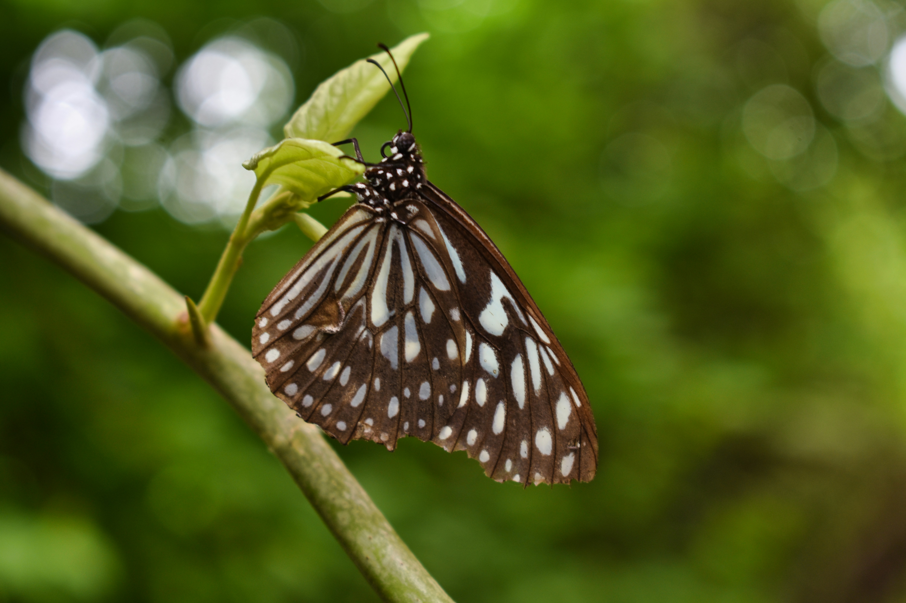
</a>
<figcaption style="text-align:center; color:gray; font-size:0.9rem;"></figcaption>
</figure>

<figure style="margin: 0;">
<a href="photos/srivatsan-balaji-WCjeeeBJEH4-unsplash.jpg" target="_blank">
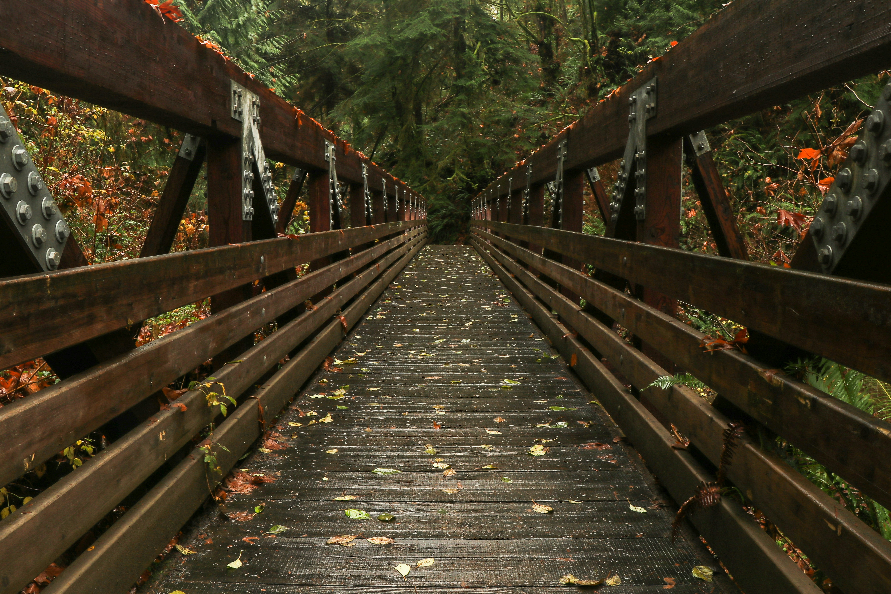
</a>
<figcaption style="text-align:center; color:gray; font-size:0.9rem;"></figcaption>
</figure>

<figure style="margin: 0;">
<a href="photos/srivatsan-balaji-wZMVYtJXHm0-unsplash.jpg" target="_blank">
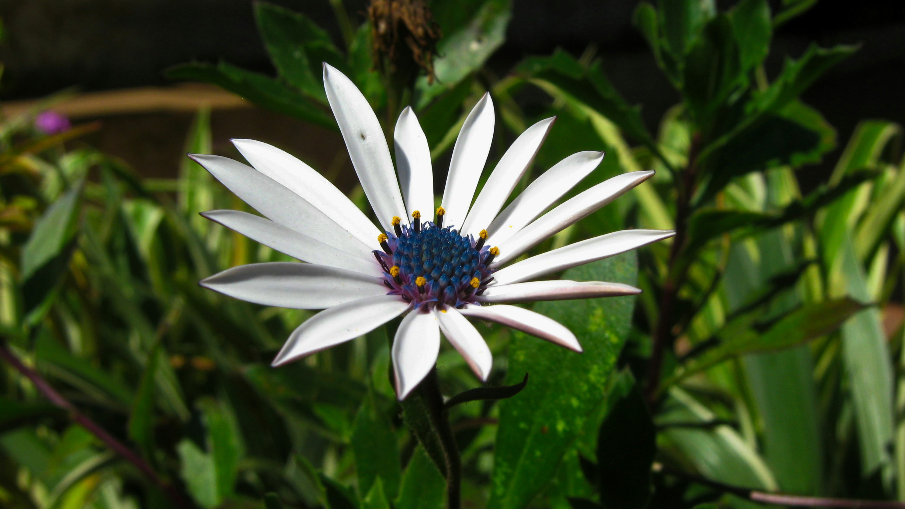
</a>
<figcaption style="text-align:center; color:gray; font-size:0.9rem;"></figcaption>
</figure>

