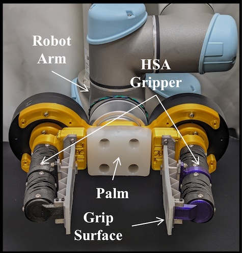

### Torsion-Resistant Handed-Shearing Auxetics (HSA)-based Soft Gripper

Soft robots excel where delicate manipulation and safe human-robot collaboration are vital. However, a lack of skeleton makes it unsuitable for most practical applications.
In this work, I addressed this problem by designing and integrating a torsion-resistant straing limiting layer (TR-SLL) to metamaterial-based soft grippers.
This reduces out-of-plane bending while maintaining the gripper’s compliance and in-plane flexibility. 

{width=25%}

*HSA gripper mounted to the UR5 robot arm*

As a result, the use of our TR-SLL HSA gripper enabled grasping of payloads over 1 kg when pinched. It also helped us achieve a lifting
capacity of 5 kg when loading using the TR-SLL element. We were able to hit a peak pinch grasp force of 5.8 N and a peak planar caging force of 14.5 N, which is
a huge payload achieved by a soft gripper when lifting objects perpendicular to the gravity.

---

*This work was supported by the NSF, Murdock Charitable Trust, and the Office of Naval Research (ONR)*