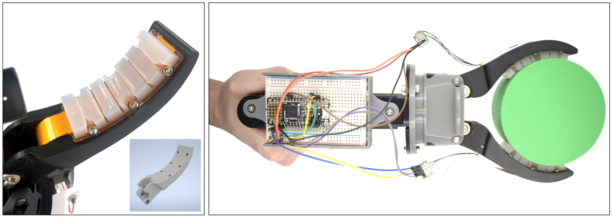
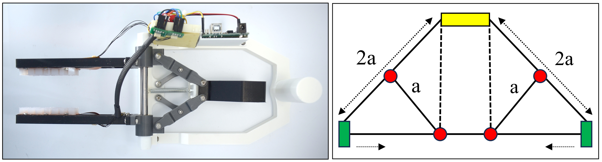

### Flexible Sensor-Integrated Bravo End Effector for Underwater Manipulation

{width=70%}

<em>Left: Tactile sensors mounted to a modified 3D-printed version of a Bravo end effector, with a CAD rendering (bottom right).
Right: Assembly of the prototype.
</em>

Underwater manipulation is challenging due to low visibility and turbulent conditions, where mere visual feedback is
insufficient to assess grasp stability. Tactile sensors address this by providing real-time pressure data during underwater
operations, and can also be used to train slip detection classifiers to assist ROV operators. I developed a modified bravo end effector
that allows flexible barometric sensors to be mounted using mechanical fasteners, enabling data collection to control slip parameters
and simulate subsea conditions. In addition to this, we developed a data collection procedure to perform 
slip characterization that simulated conditions that occur during underwater grasping.

Article: [IEEE Xplore](https://ieeexplore.ieee.org/document/11330401){target="_blank"}

*This work was supported by the Office of Naval Research (ONR), U.S. Department of Defense*

### Torsion-Resistant Handed Shearing Auxetics (HSA)-based Soft Gripper

Soft robots are ideal for delicate manipulation and safe human-robot interaction, but their lack of rigid structure limits real-world adoption. We designed a torsion-resistant
strain limiting layer (TR-SLL) and integrated it to handed shearing auxetics to fabricate a soft gripper.
I utilized FEA simulations to conduct a parametric design study and determine the optimal TR-SLL configuration.
The TR-SLL minimizes out-of-plane bending while preserving the gripper's in-plane compliance and flexibility.
The resulting TR-SLL-integrated HSA gripper lifted a payload of over 1 kg (pinch grasp), and 5 kg when loaded through the TR-SLL element.
We achieved a peak pinch force of 5.8 N, and a peak planar caging force of 14.5 N, a significant capacity for a soft gripper lifting objects perpendicular to gravity.

Article: [arXiv](https://arxiv.org/abs/2412.07976){target="_blank"}

<video width="70%" autoplay loop muted playsinline>
  <source src="projects/HSA-Gripper-Lifting.mp4" type="video/mp4">
</video>

<em>HSA Gripper lifting objects from the YCB object dataset to benchmark robot grasping and manipulation. The gripper achieved a success rate of 86% when tested with 43 objects.</em>

*This work was supported by the NSF, the Murdock Charitable Trust, and the Office of Naval Research (ONR).*

### Parallel-Jaw Gripper for Learning Soft Fruit Picking

{width=80%}

<em>Left: Parallel-jaw gripper assembly. Right: Overview of mirrored Scott-Russell mechanism used for gripper actuation.
</em>

Harvesting soft fruits like blackberries requires precise grasp control — too much force damages the fruit, too little causes
it to slip. To study this, I built a sensorized parallel-jaw gripper integrated with tactile sensors, designed to work with
a blackberry proxy that simulates real fruit properties. This mechanically-operated gripper allows human-controlled data
collection, replicating soft fruit grasping conditions to train robots on detecting berry maturity and applying the correct
grasp pressure. Unlike conventional parallel-jaw grippers that rely on two independent motors and linear rails, this
design uses a mirrored Scott-Russell linkage driven by a single linear actuator, reducing mechanical complexity and cost.
The mechanism used here lays the foundation to build a low-cost automated environment for training, though this remains
an open direction for future work.

*This work was supported by the National Science Foundation (NSF).*

### Handed-Shearing Auxetics (HSA)-based Soft Robot Arm

<video width="70%" autoplay loop muted playsinline>
  <source src="projects/HSA-Arm-Lifting.mp4" type="video/mp4">
</video>

<em>Left: HSA arm lifting a 600 g YCB mustard bottle and Right: Arm lifting a 2.3 kg payload vertically while supporting its own weight</em>

Expanding on the previous work on HSA grippers, we designed and built a soft robot arm with auxetics and bending, extending,
and torsionally-rigid shafts (a different kind of metamaterial). This arm does not require hanging configuration to lift heavy
payloads unlike previously developed soft robot arms. They can be mounted horizontally or vertically to lift payloads, perform
tasks such as pipe inspection and underwater docking due to its compliance.

Article: [arXiv](https://arxiv.org/abs/2501.09819){target="_blank"}

*This work was supported by the Murdock Charitable Trust and the Office of Naval Research (ONR).*

