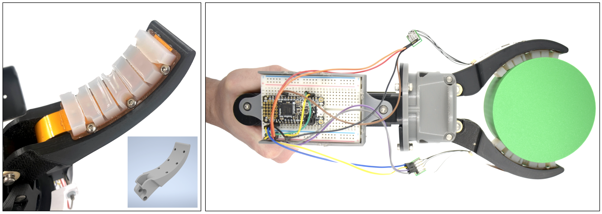
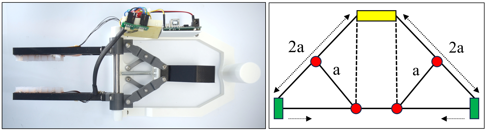
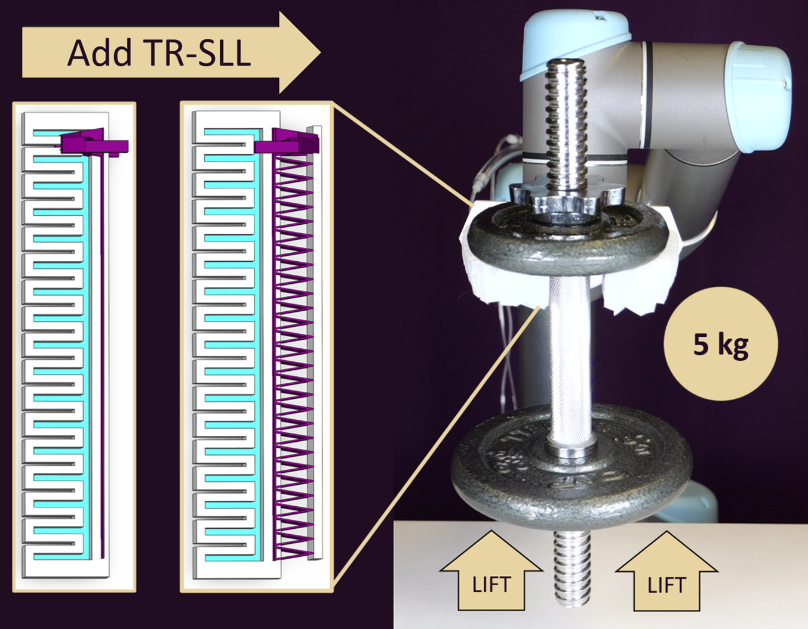

### Flexible Sensor-Integrated End Effector for Underwater Manipulation {toc-text="Underwater Manipulation"}

Underwater manipulation is challenging due to low visibility and turbulent conditions, where mere visual feedback is
insufficient to assess grasp stability. Tactile sensors address this by providing real-time pressure data during subsea
manipulation, and can also be used to train slip detection classifiers to assist ROV operators. I built a
prototype with a modified Bravo end effector and integrated flexible sensor, that can be mounted to existing gripper profiles.
We also developed a data collection procedure to perform slip characterization, simulating conditions that occur during underwater grasping. Additionally,
I developed a [PyVista](https://pyvista.org/){target="_blank"}-based 3D visualizer that provides real-time finger position feedback, utilizing a time-of-flight sensor.

Read: [IEEE Xplore](https://ieeexplore.ieee.org/document/11330401){target="_blank"}

::: funding
This work was supported by the Office of Naval Research (ONR), U.S. Department of Defense.
:::

::: {style="text-align: center; margin: 25px auto;"}
{width=70%}
:::

---

### Torsion-Resistant Handed Shearing Auxetics (HSA)-based Soft Gripper {toc-text="Soft Gripper"}

Soft robots are ideal for delicate manipulation and safe human-robot interaction, but their lack of rigid structure limits real-world adoption. We designed a torsion-resistant
strain limiting layer (TR-SLL) and integrated it to [handed shearing auxetics](https://www.science.org/doi/10.1126/science.aar4586){target="_blank"} (HSA)
to fabricate a soft gripper. I utilized FEA simulations to conduct a parametric design study and determine the optimal TR-SLL design configuration.
The TR-SLL minimizes out-of-plane bending while preserving the gripper's in-plane compliance and flexibility.
The resulting TR-SLL-integrated HSA gripper lifted a payload of over 1 kg (pinch grasp), and 5 kg when loaded through the TR-SLL element.
We achieved a peak pinch force of 5.8 N, and a peak planar caging force of 14.5 N, a significant capacity for a soft gripper lifting objects perpendicular to gravity.

Read: [IEEE Xplore](https://ieeexplore.ieee.org/abstract/document/11522819){target="_blank"} • [arXiv preprint](https://arxiv.org/abs/2412.07976){target="_blank"}

::: funding
This work was supported by the National Science Foundation (NSF), the Murdock Charitable Trust, and the Office of Naval Research (ONR).
:::

::: {style="margin: 30px auto; text-align: center;"}
<video src="assets/videos/hsa-gripper-ycb.mp4" width="70%" autoplay loop muted playsinline style="display: block; margin: 0 auto; border-radius: 4px;"></video>

HSA gripper lifting objects from the YCB object dataset to benchmark robot grasping and manipulation. The gripper achieved a success rate of 86% when tested with 43 objects.

:::

---

### Handed-Shearing Auxetics (HSA)-based Soft Robot Arm {toc-text="Soft Auxetic Arm"}

Expanding the work on HSA grippers, we designed and built a soft robot arm with auxetics and bending, extending,
and torsionally-rigid shafts (a different kind of metamaterial). This arm does not require hanging configuration to lift heavy
payloads unlike previously developed soft robot arms. They can be mounted horizontally or vertically to lift payloads, perform
tasks such as pipe inspection and underwater docking due to its compliance.

Read: [arXiv preprint](https://arxiv.org/abs/2501.09819){target="_blank"}

::: funding
This work was supported by the Murdock Charitable Trust and the Office of Naval Research (ONR).
:::

::: {style="margin: 30px auto; text-align: center;"}
<video src="assets/videos/HSA-Arm-Lifting.mp4" width="70%" autoplay loop muted playsinline style="display: block; margin: 0 auto; border-radius: 4px;"></video>

Left: HSA arm lifting a 600 g YCB mustard bottle and Right: Arm lifting a 2.3 kg payload vertically while supporting its own weight.

:::

---

### Parallel-Jaw Gripper for Learning Soft Fruit Picking {toc-text="Learning Soft Fruit Picking"}

Harvesting soft fruits like blackberries requires precise grasp control — too much force damages the fruit, too little causes
it to slip. To study this, I built a sensorized parallel-jaw gripper integrated with tactile sensors, designed to work with
a blackberry proxy that simulates real fruit properties. This mechanically-operated gripper allows human-controlled data
collection, replicating soft fruit grasping conditions to train robots on detecting berry maturity and applying the correct
grasp pressure. Unlike conventional parallel-jaw grippers that rely on two independent motors and linear rails, this
design uses a mirrored [Scott-Russell linkage](https://en.wikipedia.org/wiki/Scott_Russell_linkage){target="_blank"} driven by a single linear actuator, reducing mechanical complexity and cost.
The mechanism used here lays the foundation to build a low-cost automated environment for training, though this remains
an open direction for future work.

Read: [IEEE Xplore](https://ieeexplore.ieee.org/abstract/document/11522859){target="_blank"}

::: funding
This work was supported by the National Science Foundation (NSF).
:::

::: {style="text-align: center; margin: 25px auto;"}
{width=80%}
:::

---

### Enhancing Pneumatic Network Actuators (Pneu-Net) using Additively-Manufactured Torsion-Resistant Strain Limiting Layers {toc-text="Enhanced Pneu-Net Actuators"}

This work introduced 3D-printed torsion-resistant strain limiting layers, which were later integrated into HSA grippers
(read above). Pneu-Nets are the primary form of soft robotic grippers, but a key limitation to their wider adoption is
their inability to grasp significant payloads due to objects slipping out of grasps. They're primarily made up of silicone elastomers
and lack a rigid skeleton to counteract twisting forces. We did overcome this limitation by introducing a torsionally-rigid strain limiting layer (TR-SLL). TR-SLL reduced out-of-plane deformations
by up to 97% compared to a benchmark Pneu-Net actuator from the [Soft Robotics Toolkit](https://softroboticstoolkit.com/actuators){target="_blank"}.

Read: [IEEE Xplore](https://ieeexplore.ieee.org/document/10521982){target="_blank"} • [arXiv preprint](https://arxiv.org/abs/2311.02454){target="_blank"}

::: funding
This work was supported by the NSF, the Murdock Charitable Trust and the Office of Naval Research (ONR).
:::

{fig-align="center" width=50%}

